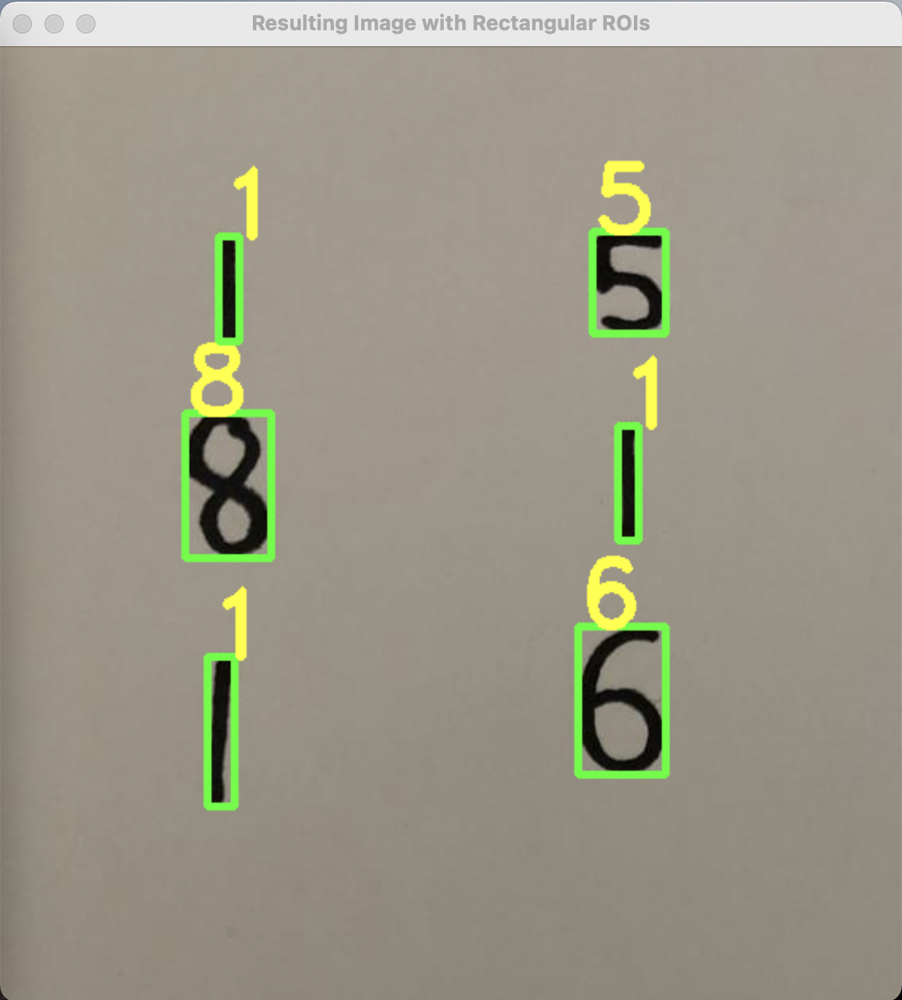
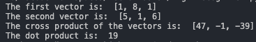

# VectorAssist
Utilized computer vision to take an input picture of two handwritten vectors, and classify the numbers to perform vector arithmetic. I trained the model using the MNIST dataset, and openCV to create contours, the bounding boxes and apply a Gaussian filter.

